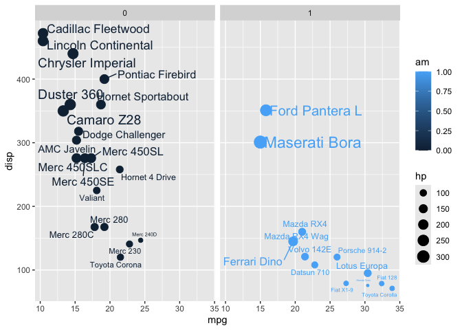

# class 5: data viz with ggplot
Angelica Rock (PID: 15781397)

R has lots of ways to make figures and graphs in particular. One that
comes with R out of the box is called **“base” R** - the ‘plot ()’
function.

``` r
cars
```

       speed dist
    1      4    2
    2      4   10
    3      7    4
    4      7   22
    5      8   16
    6      9   10
    7     10   18
    8     10   26
    9     10   34
    10    11   17
    11    11   28
    12    12   14
    13    12   20
    14    12   24
    15    12   28
    16    13   26
    17    13   34
    18    13   34
    19    13   46
    20    14   26
    21    14   36
    22    14   60
    23    14   80
    24    15   20
    25    15   26
    26    15   54
    27    16   32
    28    16   40
    29    17   32
    30    17   40
    31    17   50
    32    18   42
    33    18   56
    34    18   76
    35    18   84
    36    19   36
    37    19   46
    38    19   68
    39    20   32
    40    20   48
    41    20   52
    42    20   56
    43    20   64
    44    22   66
    45    23   54
    46    24   70
    47    24   92
    48    24   93
    49    24  120
    50    25   85

``` r
plot(cars)
```


A very popular package in this area is called **ggplot2**.

Before I can use any add-on package like this I must install it with the
‘install.packages(“ggplot2”)’ command/function.

Then to use the package I need to load it with a ‘library(ggplot2)’
call.

``` r
library(ggplot2)
ggplot(cars) + 
    aes (x = speed, y = dist) + 
    geom_point()
```


``` r
ggsave("myplot.png")
```

    Saving 7 x 5 in image

For “simple” plots like this, one base R code will be much shorter than
ggplot code.

Let’s fit a model and show it on my plot:

``` r
ggplot(cars) + 
    aes (x = speed, y = dist) + 
    geom_point() + 
    geom_line() +
    geom_smooth()
```

    `geom_smooth()` using method = 'loess' and formula = 'y ~ x'


Every ggplot has at least 3 layers

- **data** (data.frame with the numbers and stuff you want to plot)
- **aes**thetics (mapping of your data columns to your plot)
- **geom**s (there are tons of these, basics are ‘geom_point()’,
  ‘geom_line()’, ‘geom_col()’)

Make me a ggplot of the `mtcars` data set using `mpg` vs `disp` and set
the size of the points of the ‘hp’ and set the color to ‘am’

``` r
library(ggrepel)
ggplot(mtcars) + 
    aes (x = mpg, y = disp, size = hp, col = am, label=rownames(mtcars)) + 
    geom_point() + 
    facet_wrap(~am) +
    geom_text_repel()
```



``` r
ggplot(mtcars) + 
    aes (x = mpg, y = disp, size = hp, col = am, label=rownames(mtcars)) + 
    geom_point() + 
    labs(title="Speed and Stopping Distances of Cars",
       x="Speed (MPH)", 
       y="Stopping Distance (ft)",
       caption="Dataset: 'cars'") +
  geom_smooth(method="lm", se=FALSE) +
  theme_bw()
```

    Warning: Using `size` aesthetic for lines was deprecated in ggplot2 3.4.0.
    ℹ Please use `linewidth` instead.

    `geom_smooth()` using formula = 'y ~ x'

    Warning: The following aesthetics were dropped during statistical transformation: size,
    colour, and label.
    ℹ This can happen when ggplot fails to infer the correct grouping structure in
      the data.
    ℹ Did you forget to specify a `group` aesthetic or to convert a numerical
      variable into a factor?


# Gene expression dataset

``` r
url <- "https://bioboot.github.io/bimm143_S20/class-material/up_down_expression.txt"
genes <- read.delim(url)
head(genes)
```

            Gene Condition1 Condition2      State
    1      A4GNT -3.6808610 -3.4401355 unchanging
    2       AAAS  4.5479580  4.3864126 unchanging
    3      AASDH  3.7190695  3.4787276 unchanging
    4       AATF  5.0784720  5.0151916 unchanging
    5       AATK  0.4711421  0.5598642 unchanging
    6 AB015752.4 -3.6808610 -3.5921390 unchanging

``` r
nrow(genes)
```

    [1] 5196

``` r
colnames(genes)
```

    [1] "Gene"       "Condition1" "Condition2" "State"     

``` r
ncol(genes)
```

    [1] 4

``` r
table(genes$State)
```


          down unchanging         up 
            72       4997        127 

``` r
table(genes$State) / nrow(genes)
```


          down unchanging         up 
    0.01385681 0.96170131 0.02444188 

``` r
round(table(genes$State) / nrow(genes) *100, 2)
```


          down unchanging         up 
          1.39      96.17       2.44 

# Name object of drug treatment graph

``` r
p <- ggplot(genes) + 
    aes(x=Condition1, y=Condition2, col=State) +
    geom_point()
```

# Plot drug treatment graph

``` r
ggplot(genes) + 
    aes(x=Condition1, y=Condition2, col=State) +
    geom_point()
```


# Scale color manually

``` r
p + scale_colour_manual( values=c("blue","gray","red") )
```


# Add labels

``` r
p + scale_colour_manual(values=c("blue","gray","red")) +
    labs(title="Gene Expresion Changes Upon Drug Treatment",
         x="Control (no drug) ",
         y="Drug Treatment")
```


# Gapminder Dataset - Two ways to retrieve package

``` r
# install.packages("dplyr")  ## un-comment to install if needed
library(dplyr)
```


    Attaching package: 'dplyr'

    The following objects are masked from 'package:stats':

        filter, lag

    The following objects are masked from 'package:base':

        intersect, setdiff, setequal, union

``` r
library(gapminder)
# Can retrieve dataset using url and read.delim function
url <- "https://raw.githubusercontent.com/jennybc/gapminder/master/inst/extdata/gapminder.tsv"
gapminder <- read.delim(url)
```

# Creating plots from gapminder dataset

``` r
gapminder_2007 <- gapminder %>% filter(year==2007)
ggplot(gapminder_2007) +
  aes(x=gdpPercap, y=lifeExp) +
  geom_point()
```


