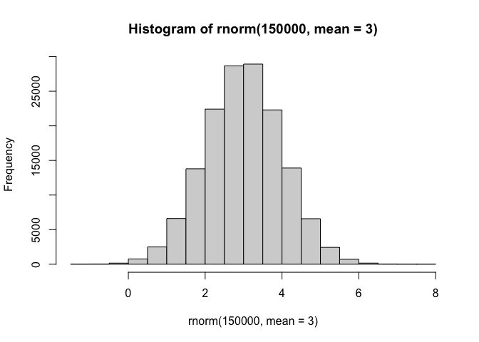
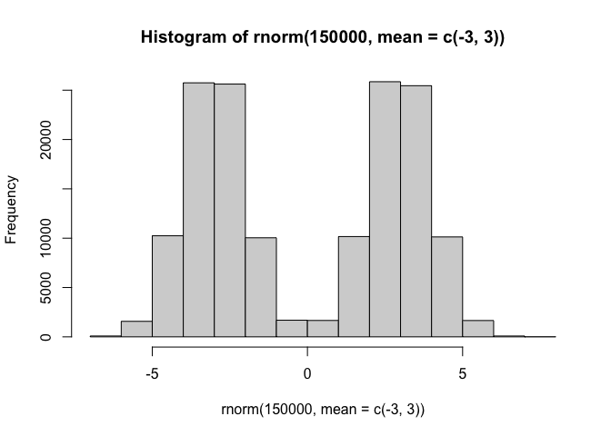
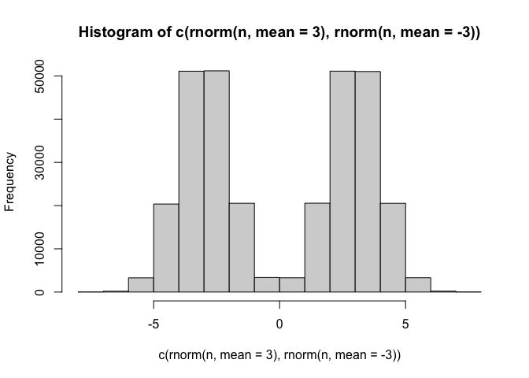
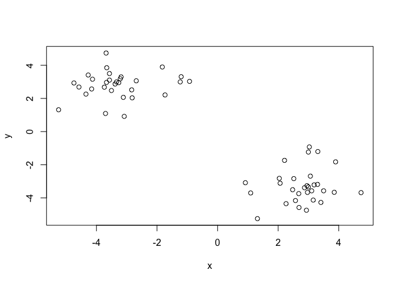
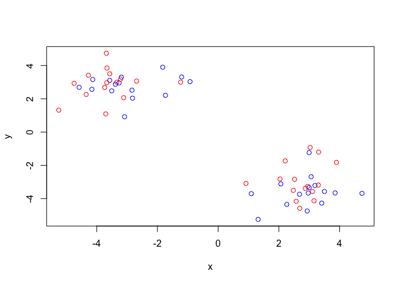
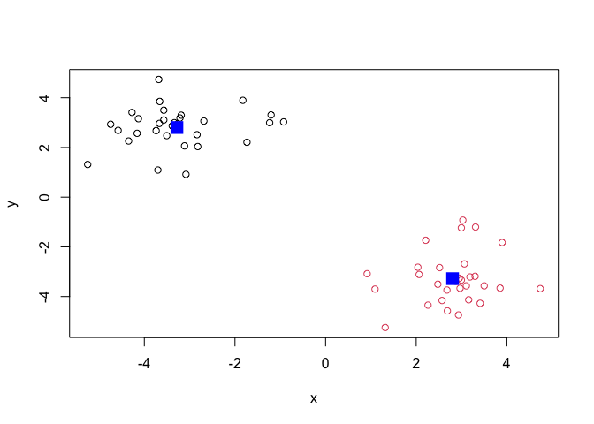
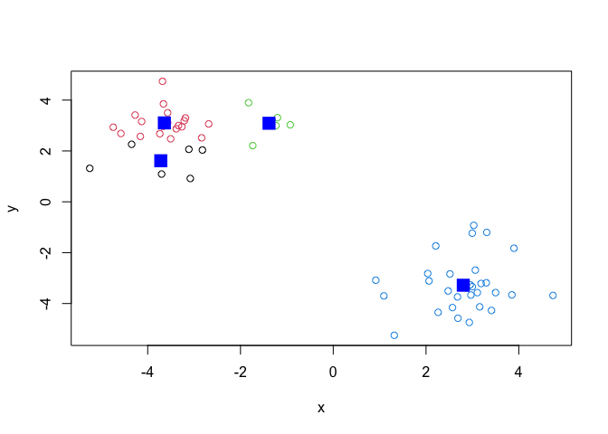
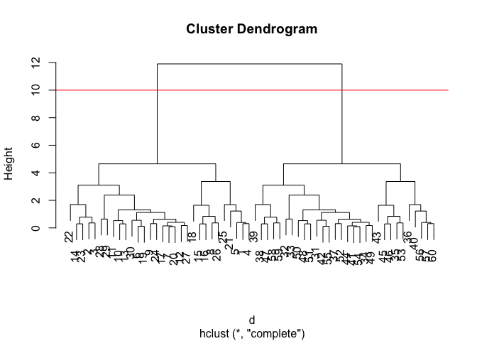
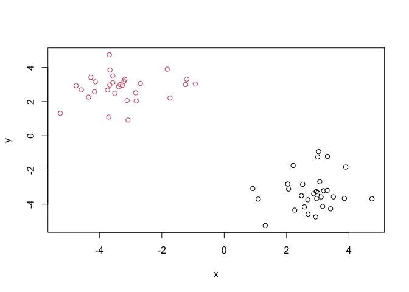
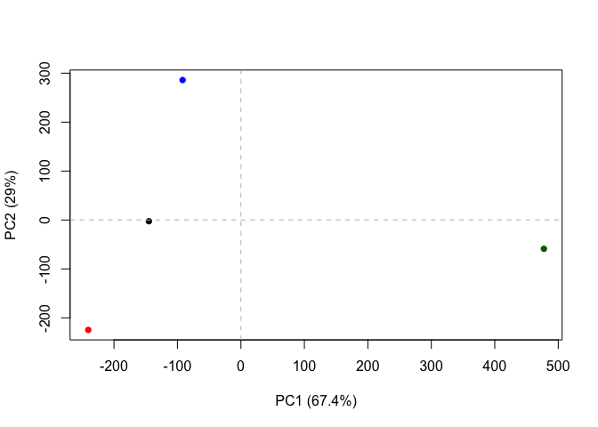

# lab7
Angelica Rock (PID:15781397)

Before we get into clustering methods let’s make some sample data to
cluster where we know what the answer should be

``` r
hist(rnorm(150000, mean=3))
```



``` r
hist(rnorm(150000, mean=c(-3,3)))
```



``` r
#this is the same as
n=150000
hist(c(rnorm(n, mean=3), rnorm(n, mean=-3)))
```



``` r
n=30
x <- c(rnorm(n, mean = 3), rnorm(n, mean=-3))
y <- rev(x)

z <- cbind(x,y)
z
```

                   x          y
     [1,]  3.0289072 -0.9262702
     [2,]  2.2611083 -4.3467087
     [3,]  2.5706650 -4.1588261
     [4,]  2.9966430 -1.2345821
     [5,]  3.3093282 -1.2023201
     [6,]  3.1863007 -3.2129793
     [7,]  2.9507039 -3.2634456
     [8,]  3.8513800 -3.6607946
     [9,]  2.4771292 -3.5050650
    [10,]  2.0647390 -3.1123792
    [11,]  2.5156491 -2.8366041
    [12,]  2.9671717 -3.6677844
    [13,]  2.0366915 -2.8207598
    [14,]  2.9331027 -4.7426738
    [15,]  3.1577084 -4.1303620
    [16,]  3.4108616 -4.2718443
    [17,]  2.8693785 -3.3840639
    [18,]  4.7372898 -3.6813451
    [19,]  3.2990031 -3.1862700
    [20,]  2.9966617 -3.3373244
    [21,]  2.2097812 -1.7350553
    [22,]  1.3155780 -5.2496358
    [23,]  2.6879347 -4.5781446
    [24,]  2.6787096 -3.7392144
    [25,]  3.8962722 -1.8254832
    [26,]  3.5002877 -3.5706263
    [27,]  3.1059248 -3.5705758
    [28,]  1.0914028 -3.7006495
    [29,]  0.9173824 -3.0818591
    [30,]  3.0633123 -2.6857955
    [31,] -2.6857955  3.0633123
    [32,] -3.0818591  0.9173824
    [33,] -3.7006495  1.0914028
    [34,] -3.5705758  3.1059248
    [35,] -3.5706263  3.5002877
    [36,] -1.8254832  3.8962722
    [37,] -3.7392144  2.6787096
    [38,] -4.5781446  2.6879347
    [39,] -5.2496358  1.3155780
    [40,] -1.7350553  2.2097812
    [41,] -3.3373244  2.9966617
    [42,] -3.1862700  3.2990031
    [43,] -3.6813451  4.7372898
    [44,] -3.3840639  2.8693785
    [45,] -4.2718443  3.4108616
    [46,] -4.1303620  3.1577084
    [47,] -4.7426738  2.9331027
    [48,] -2.8207598  2.0366915
    [49,] -3.6677844  2.9671717
    [50,] -2.8366041  2.5156491
    [51,] -3.1123792  2.0647390
    [52,] -3.5050650  2.4771292
    [53,] -3.6607946  3.8513800
    [54,] -3.2634456  2.9507039
    [55,] -3.2129793  3.1863007
    [56,] -1.2023201  3.3093282
    [57,] -1.2345821  2.9966430
    [58,] -4.1588261  2.5706650
    [59,] -4.3467087  2.2611083
    [60,] -0.9262702  3.0289072

``` r
plot(z)
```



## K-means clustering

The function in base R for k-means clustering is called `kmeans()`.

``` r
km <- kmeans(z, centers = 2)
```

> Q. Print out the cluster membership vector (i.e. our main answer)

``` r
km$cluster
```

     [1] 2 2 2 2 2 2 2 2 2 2 2 2 2 2 2 2 2 2 2 2 2 2 2 2 2 2 2 2 2 2 1 1 1 1 1 1 1 1
    [39] 1 1 1 1 1 1 1 1 1 1 1 1 1 1 1 1 1 1 1 1 1 1

Plot z with the cluster

``` r
plot(z, col=c("red", "blue"))
```



Plot with clustering results

``` r
plot(z, col=km$cluster)
points(km$centers, col="blue", pch=15, cex=2)
```



> Q. Can you cluster our data in `z` into four clusters?

``` r
km4 <- kmeans(z, centers = 4)
plot(z, col=km4$cluster)
points(km4$centers, col="blue", pch = 15, cex =2)
```



## Hierarchical Clustering

The main function for hierarchical clustering in base R is called
`hclust()`

Unlike `kmeans()` I cannot just pass in my data as input. I first need a
distance matrix from my data

``` r
d <- dist(z)
hc <- hclust(d)
hc
```


    Call:
    hclust(d = d)

    Cluster method   : complete 
    Distance         : euclidean 
    Number of objects: 60 

There is a specific hclust plot() method…

``` r
plot(hc)
abline(h=10, col="red")
```



To get my main clustering result (i.e. the membership vector) I can
“cut” my tree at a given height. To do this I will use the `cutree()`

``` r
grps <- cutree(hc, h=10)
grps
```

     [1] 1 1 1 1 1 1 1 1 1 1 1 1 1 1 1 1 1 1 1 1 1 1 1 1 1 1 1 1 1 1 2 2 2 2 2 2 2 2
    [39] 2 2 2 2 2 2 2 2 2 2 2 2 2 2 2 2 2 2 2 2 2 2

``` r
plot(z, col=grps)
```



# Principal Component Analysis

Principal component analysis (PCA) is a well established “multivariate
statistical technique” used to reduce the dimensionality of a complex
data set to a more manageable number (typically 2D or 3D). This method
is particularly useful for highlighting strong paterns and relationships
in large datasets (i.e. revealing major similarities and diferences)
that are otherwise hard to visualize.

## PCA of UK food data

Data import

``` r
url <- "https://tinyurl.com/UK-foods"
x <- read.csv(url)
```

> Q1. How many rows and columns are in your new data frame named x? What
> R functions could you use to answer this questions?

``` r
nrow(x)
```

    [1] 17

``` r
ncol(x)
```

    [1] 5

``` r
# use you can use
#dim(x)
```

## Preview the first 6 rows

``` r
head(x)
```

                   X England Wales Scotland N.Ireland
    1         Cheese     105   103      103        66
    2  Carcass_meat      245   227      242       267
    3    Other_meat      685   803      750       586
    4           Fish     147   160      122        93
    5 Fats_and_oils      193   235      184       209
    6         Sugars     156   175      147       139

First approach: We don’t want to have row names set as the first column
of the x data frame, only the 4 countries, so we can change this using
the function below: \# Note how the minus indexing works and check the
dimensions

``` r
rownames(x) <- x[,1]
x <- x[,-1]
head(x)
```

                   England Wales Scotland N.Ireland
    Cheese             105   103      103        66
    Carcass_meat       245   227      242       267
    Other_meat         685   803      750       586
    Fish               147   160      122        93
    Fats_and_oils      193   235      184       209
    Sugars             156   175      147       139

``` r
#dim(x)
```

# Second approach: Instead of using the above code, you can instead use this to change the row names from being set as the first column of the x data frame to only having the four countries as row names

``` r
#dim(x)
x <- read.csv(url, row.names=1)
head(x)
```

                   England Wales Scotland N.Ireland
    Cheese             105   103      103        66
    Carcass_meat       245   227      242       267
    Other_meat         685   803      750       586
    Fish               147   160      122        93
    Fats_and_oils      193   235      184       209
    Sugars             156   175      147       139

> Q2. Which approach to solving the ‘row-names problem’ mentioned above
> do you prefer and why? Is one approach more robust than another under
> certain circumstances?

I prefer to have the second approach because if you were to rerun the
first approach block multiple times, it will keep cutting down the row
name of the one in the first place and the number of countries will
shrink from 3 to 2 and so on

# Generating a bar plot from the data

``` r
barplot(as.matrix(x), beside=T, col=rainbow(nrow(x)))
```


> Q3: Changing what optional argument in the above barplot() function
> results in the following plot?

beside=FALSE leads to the plot below because changing beside to false
makes the columns of height portrayed as stacked bars, whereas with
true, the columns are portrayed as juxtaposed bars

``` r
barplot(as.matrix(x), beside=FALSE, col=rainbow(nrow(x)))
```


``` r
pairs(x, col=rainbow(10), pch=16)
```


> Q5: Generating all pairwise plots may help somewhat. Can you make
> sense of the following code and resulting figure? What does it mean if
> a given point lies on the diagonal for a given plot?

This code and resulting figure is showing a matrix of scatterplots where
you can compare the individual food types with another country. Each
point represents a different food type. I think this means that the dots
on the diagonal are more strongly correlated with the other country
whereas the dots away from the diagonal are less strongly correlated
with the other country.

## PCA to the rescue

The main function to do PCA in base R is called `prcomp()`

Note that I need to take the transpose of this particular data as that
is what the `prcomp()` help page was asking for

``` r
pca <- prcomp(t(x))
summary(pca)
```

    Importance of components:
                                PC1      PC2      PC3       PC4
    Standard deviation     324.1502 212.7478 73.87622 2.921e-14
    Proportion of Variance   0.6744   0.2905  0.03503 0.000e+00
    Cumulative Proportion    0.6744   0.9650  1.00000 1.000e+00

Let’s see what is inside our result object “pca” that we just
calculated:

``` r
attributes(pca)
```

    $names
    [1] "sdev"     "rotation" "center"   "scale"    "x"       

    $class
    [1] "prcomp"

To make our main result figure, called a “PC plot” (or “score plot”,
“ordination plot”, or “PC1 vs PC2 plot”)

``` r
plot(pca$x[,1], pca$x[,2], 
  col=c("black", "red", "blue", "darkgreen"), 
  pch=16, xlab="PC1 (67.4%)", ylab="PC2 (29%)")
abline(h=0, col="grey", lty="dashed")
abline(v=0, col="grey", lty="dashed")
```



# Variable Loadings Plot

``` r
## Lets focus on PC1 as it accounts for > 90% of variance 
par(mar=c(10, 3, 0.35, 0))
barplot( pca$rotation[,1], las=2 )
```


